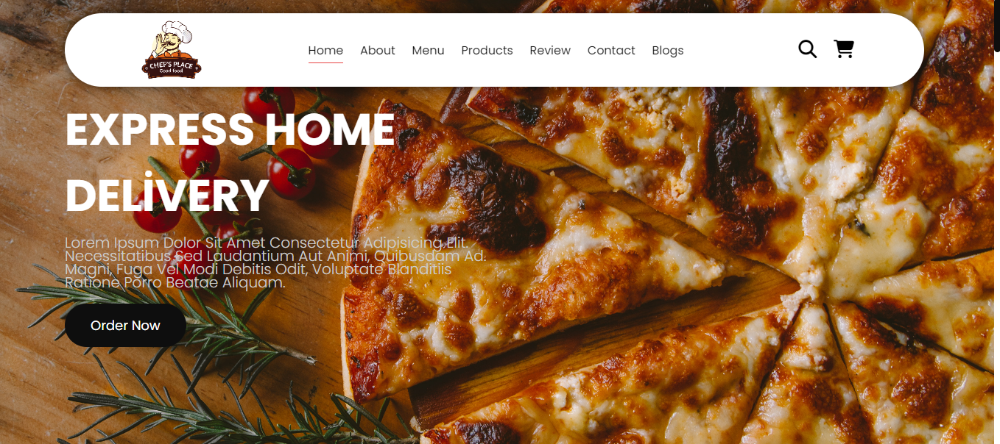

<h1> 
      A Website Designed For Fast Food Restaurant</h1>

<h2>Content</h2>

<h3>
    **General information about the restaurant  
    **Can be applied to another concept Fast food or others 
    **Can be used for restaurants and  
   
**CONTAINS;** 
** Restaurant Menu list   
**cart  
**search-bar to find products easily  
**products details 
    
 
   ** services and contact section with google maps 
   ** customers Comments section and Blogs section 
   ** social media communication area   
   **footer area 

</h3>

<h2>Used technologies</h2>

<h3>
    *** HTML5 And CCS were used *** 
    ***made dynamic with javaScript 
    ***separate html structures with pagination 
    *** Enriched with google fonts and Font awesome*** 
    *** All of responsive designe*** 
    
</h3>

<h2>GIF</h2>

<h2> ScreenShoots</h2>

